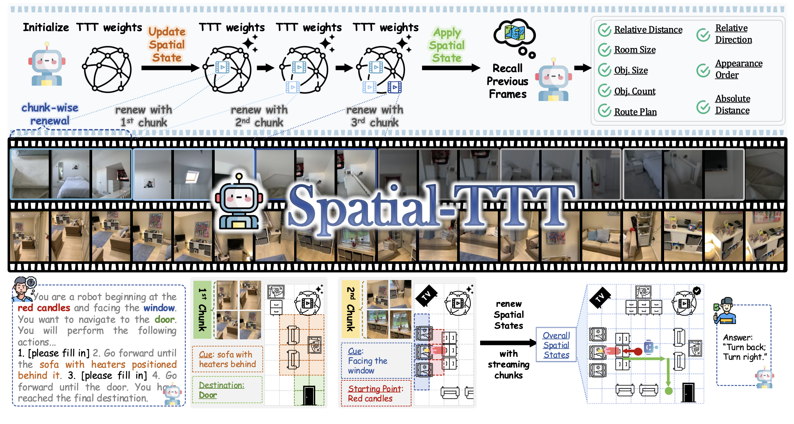
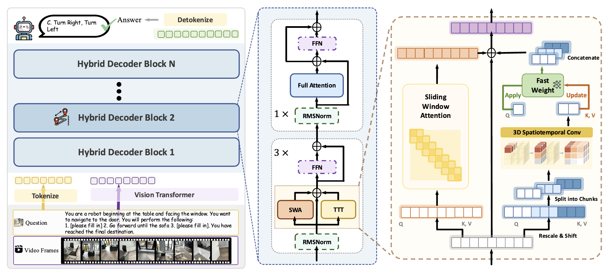

<div align="center">

# ✨ Spatial-TTT: Streaming Visual-based Spatial Intelligence with Test-Time Training ✨

<p align="center">
    <a href="https://liuff19.github.io/">Fangfu Liu</a><sup>*</sup>,
    <a href="https://github.com/diankun-wu/">Diankun Wu</a><sup>*</sup>,
    <a href="https://chijw.github.io/">Jiawei Chi</a><sup>*</sup>,
    Yimo Cai<sup>1</sup>,
    Yi-Hsin Hung<sup>1</sup>,
    <a href="https://yuxumin.github.io/">Xumin Yu</a><sup>2</sup>,
    <a href="https://scholar.google.com/citations?user=4dokjDoAAAAJ&hl=zh-CN">Hao Li</a><sup>3</sup>,
    <br>
    <a href="https://ancientmooner.github.io/">Han Hu</a><sup>2</sup>,
    <a href="https://raoyongming.github.io/">Yongming Rao</a><sup>†,2</sup>,
    <a href="https://duanyueqi.github.io/">Yueqi Duan</a><sup>†,1</sup>
    <br>
    <sup>*</sup>Equal Contribution &emsp; <sup>†</sup>Corresponding Author
    <br>
    <sup>1</sup>Tsinghua University &emsp; <sup>2</sup>Tencent Hunyuan &emsp; <sup>3</sup>NTU
</p>

<a href='https://arxiv.org/abs/XXXX.XXXXX'></a> &nbsp;&nbsp;&nbsp;&nbsp;
<a href='https://liuff19.github.io/Spatial-TTT/'></a> &nbsp;&nbsp;&nbsp;&nbsp;
<a></a> &nbsp;&nbsp;&nbsp;&nbsp;



</div>

<strong>Spatial-TTT:</strong> We propose Spatial-TTT, a framework for streaming visual-based spatial intelligence with Test-Time Training (TTT). Given a visual-based spatial task, our method updates spatial state with streaming chunks then answers the question, achieving state-of-the-art performance on video spatial benchmarks.

---

## 📢 News

- **[Date]** We release the training and evaluation code for **Spatial-TTT**, the official implementation of *Spatial-TTT: Streaming Visual-based Spatial Intelligence with Test-Time Training*.


## 🌟 Overview



**Overview of Spatial-TTT.** The model employs a hybrid architecture that interleaves TTT layers with self-attention anchor layers to preserve pretrained knowledge while enabling efficient long spatial-context compression. Within each TTT layer, sliding-window attention (SWA) and the TTT branch operate in parallel with shared Q/K/V projections; the TTT branch applies a spatial-predictive mechanism with depthwise spatiotemporal convolution to capture geometric structure and temporal continuity.

## 🌟 Introduction

Humans perceive and understand real-world spaces through a stream of visual observations. The ability to **streamingly maintain and update spatial evidence** from potentially unbounded video streams is essential for spatial intelligence. The core challenge is not simply longer context windows but how spatial information is selected, organized, and retained over time.

**Spatial-TTT** maintains adaptive **fast weights** that are updated online, acting as a compact non-linear memory to accumulate 3D evidence from long-horizon video streams. Key designs include:

- **Hybrid TTT architecture**: Interleaves TTT layers with self-attention anchor layers to preserve pretrained visual-semantic knowledge while enabling efficient long spatial-context compression.
- **Large-chunk updates + sliding-window attention**: Large chunk size for higher parallelism and hardware efficiency; sliding-window attention in parallel to preserve intra-chunk spatiotemporal continuity.
- **Spatial-predictive mechanism**: Lightweight depth-wise 3D convolutions on the TTT branch to capture geometric correspondence and temporal continuity across frames.
- **Dense scene description**: A dense scene-description dataset guides the model to update fast weights to memorize and organize global 3D spatial signals in a structured manner.

## ⚙️ Setup

### 1. Clone Repository

```bash
git clone https://github.com/THU-SI/Spatial-TTT.git
cd Spatial-TTT/qwen-vl-finetune
```

### 2. Environment Setup

We use conda to manage the environment. Recommended versions:

- Python 3.10+
- `torch>=2.6.0`, `torchvision`, `transformers>=4.57.0`
- `deepspeed`, `flash-attn`, `accelerate`, `peft`, `triton`, `torchcodec`

```bash
conda create -n spatial-ttt python=3.10 -y
conda activate spatial-ttt
pip install torch torchvision transformers deepspeed accelerate peft
pip install flash-attn --no-build-isolation
pip install torchcodec
```

Configure the dataset in `qwen-vl-finetune/qwenvl/data/__init__.py`: set `annotation_path` and `data_path` for **Spatial-TTT-Data-97k** (download from [THU-SI/Spatial-TTT-Data-97k](https://huggingface.co/datasets/THU-SI/Spatial-TTT-Data-97k) on Hugging Face).

## 🚂 Training

We provide a single training script with chunk size 2648 and the **Spatial-TTT-Data-97k** dataset.

### Run training

1. Set in `qwen-vl-finetune/spatial_ttt_train.sh`:
   - `MODEL_PATH`: path to pretrained Qwen3-VL (or your base checkpoint).
   - `OUTPUT_DIR`: where to save checkpoints.

2. Set **Spatial-TTT-Data-97k** paths in `qwen-vl-finetune/qwenvl/data/__init__.py`: edit `SPATIAL_TTT_DATA_97K` with your `annotation_path` and `data_path` (after downloading from [THU-SI/Spatial-TTT-Data-97k](https://huggingface.co/datasets/THU-SI/Spatial-TTT-Data-97k)).

3. From the `qwen-vl-finetune/` directory:

```bash
cd qwen-vl-finetune
# 8 GPUs by default; set NPROC_PER_NODE or CUDA_VISIBLE_DEVICES as needed
bash spatial_ttt_train.sh
```

Main settings: `lact_chunk_size=2648`, `window_size=2648`, `video_max_frames=128`, dataset `spatial_ttt_data_97k`.

## 📊 Evaluation

Evaluation on **VSI-Bench** is under `evaluation/spatial/`. Use the script with checkpoint path and output name:

```bash
# Evaluates on VSI-Bench with 128 frames
bash evaluation/spatial/scripts/eval_spatial_ttt_2b.sh /path/to/checkpoint my_model 8
```

See `evaluation/spatial/readme.md` for result summarization.

## 📦 Data and Model

We release **Spatial-TTT-nano**, an SFT model trained on a mini spatial dataset with less than 1M samples. Download: [Spatial-TTT-nano on Hugging Face](https://huggingface.co/THU-SI/Spatial-TTT-nano). See the [Releases](https://github.com/THU-SI/Spatial-TTT/releases) page for more.

We provide **Spatial-TTT-Data-97k** ([THU-SI/Spatial-TTT-Data-97k](https://huggingface.co/datasets/THU-SI/Spatial-TTT-Data-97k) on Hugging Face), a **mini** high-quality spatial dataset from Spatial-TTT with ~97k samples for training and reproduction. This is the dataset used in the configuration and training steps above.

We also release **Spatial-TTT-Data-Streaming** ([THU-SI/Spatial-TTT-Data-Streaming](https://huggingface.co/datasets/THU-SI/Spatial-TTT-Data-Streaming) on Hugging Face), part of our self-prepared streaming data. It can be helpful for **VSR** (long-horizon visual spatial recall) and **VSC** (continual visual spatial counting) related training in [Cambrian-S: Towards Spatial Supersensing in Video](https://github.com/cambrian-mllm/cambrian-s) (see [arXiv:2511.04670](https://arxiv.org/abs/2511.04670)).

## 📋 TODO

- [ ] Update the full model (trained on all data).
- [ ] Release full training data (general spatial QA and dense scene caption data).
- [ ] Release **larger-scale Spatial-TTT** models.

## 📁 Repository Structure

```
Spatial-TTT/
├── assets/
│   ├── teaser.png
│   └── pipeline.png             # Framework figure
├── qwen-vl-finetune/
│   ├── spatial_ttt_train.sh    # Spatial-TTT training (2648, Spatial-TTT-Data-97k)
│   ├── qwenvl/
│   │   ├── train/              # train_spatial_ttt.py, trainer, arguments
│   │   └── data/               # Dataset configs and data processor
│   ├── models/                 # LaCT/TTT layers (causal_swa_lact, lact_inference)
│   └── scripts/                # DeepSpeed configs (e.g. zero2.json)
├── evaluation/spatial/         # VSI-Bench evaluation scripts
└── README.md
```

## 📚 Citation

If you find Spatial-TTT useful for your research, please cite:

```bibtex
@article{liu2025spatialttt,
  title   = {Spatial-TTT: Streaming Visual-based Spatial Intelligence with Test-Time Training},
  author  = {Liu, Fangfu and Wu, Diankun and Chi, Jiawei and Cai, Yimo and Hung, Yi-Hsin and Yu, Xumin and Li, Hao and Hu, Han and Rao, Yongming and Duan, Yueqi},
  journal = {arXiv preprint arXiv:XXXX.XXXXX},
  year    = {2025}
}
```

*(Update the arXiv number when available.)*

## Acknowledgements

Thanks to these great repositories and works: [Spatial-MLLM](https://github.com/THU-SI/Spatial-MLLM), [Qwen3-VL](https://github.com/QwenLM/Qwen3-VL), [Qwen-VL-Finetune](https://github.com/QwenLM/Qwen3-VL/tree/main/qwen-vl-finetune), [Test-Time Training Done Right (LaCT)](https://github.com/a1600012888/LaCT), and the spatial understanding community.
